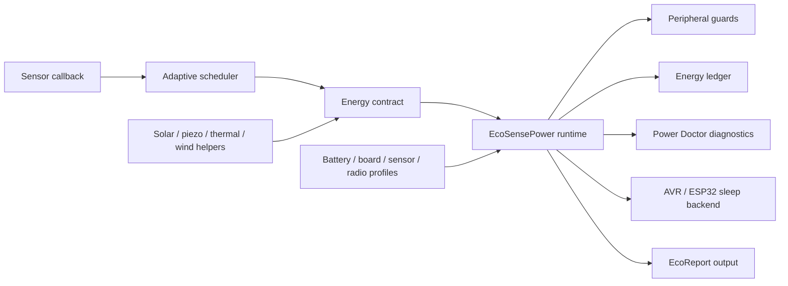

# EcoSensePower

Industrial energy-aware runtime for battery-powered Arduino sensor nodes.

<p align="center">
  
  
  
  
</p>


EcoSensePower helps Arduino developers build low-power sensor firmware with adaptive sampling, energy contracts, sleep orchestration, SoC estimation, energy-harvesting policy, radio energy modeling, Bluetooth/BLE and GPS/GNSS energy profiles, inference/anomaly energy hooks, peripheral guards, and structured diagnostics — without forcing heavy runtime dependencies.

> Status: pre-v1.0.0-RC candidate. Host-side validation is complete. The final Arduino ecosystem promotion gate is real Arduino Lint and board compile evidence. This package keeps AVR Tiny/Core mode intact and adds dependency-free Bluetooth/BLE plus GPS/GNSS energy profile coverage. Board-compile evidence remains pending until CI proves it.

> Note: On AVR UNO/Nano, EcoSensePower now defaults to AVR Tiny/Core mode: one sensor, compact report text, no full diagnostics array, no full ledger record array, and no full SoC tracker storage unless explicitly enabled. Larger boards keep the broader default capacity. Advanced users can override `ECOSENSE_PRESET_AVR_TINY`, `ECOSENSE_MAX_SENSORS`, `ECOSENSE_MAX_GUARDS`, `ECOSENSE_ENABLE_FULL_LEDGER`, `ECOSENSE_ENABLE_POWER_DOCTOR_STORAGE`, `ECOSENSE_ENABLE_SOC_TRACKER`, and related buffer macros before including the library.
> See `docs/release-status.md` and `release-evidence-v1.0.0-rc1.md` for the detailed promotion gate.


### Support tiers

| Tier | Target | Default scope |
|---|---|---|
| Tier 1A | AVR UNO/Nano Tiny Core | Basic adaptive sensor runtime, one sensor by default, compact report text, no full diagnostics/ledger/SoC storage by default |
| Tier 1B | AVR Mega / larger AVR | More SRAM; users may enable larger registries, diagnostics, ledger records, and profile-heavy examples with compile-time macros |
| Tier 2 | ESP32 / SAMD / ARM-class boards | Full runtime features, profile catalog, radio/harvester examples, diagnostics, and advanced examples |

EcoSensePower supports AVR UNO/Nano through a compact core mode. Full ecosystem demos and profile-heavy examples target boards with more SRAM such as ESP32, SAMD, Mega, or other larger Arduino-compatible boards.

`#include <EcoSensePower.h>` is the core beginner API. The profile catalog remains available through individual profile headers or the optional `#include <EcoSensePowerProfiles.h>` convenience header on boards with enough memory.

## Why EcoSensePower?

Most low-power Arduino libraries provide sleep primitives. EcoSensePower manages the whole sensor-node energy cycle: sensing, reporting, sleeping, energy accounting, adaptive intervals, diagnostics, AVR/ESP32 backends, and guarded compile-readiness paths for selected Arduino ARM boards.

It is not a replacement for low-level sleep libraries; it is a runtime layer above AVR/ESP32 sleep backends, guarded compile-readiness paths for selected Arduino ARM boards, and application-owned peripheral control.

### Runtime map




## Quick start

Start with one sensor and one report callback:

```cpp
#include <EcoSensePower.h>
EcoSensePower node;

void setup() {
  Serial.begin(115200);
  node.sensor("soil")
    .read([]() -> float { return (float)analogRead(A0); })
    .minIntervalMs(EcoTime::minutes(5))
    .maxIntervalMs(EcoTime::hours(6))
    .changeThreshold(20.0f);
  node.onReport([](const EcoReport& report) {
    char reportText[96];
    Serial.println(report.toText(reportText, sizeof(reportText)));
  });
  node.begin();
}

void loop() { node.loop(); }
```

`node.loop()` drives the EcoSensePower runtime and may block while the selected backend sleeps. It is not a non-blocking task scheduler.

The quick start intentionally avoids profiles, radios, harvesters, and advanced diagnostics so a new Arduino user can start with one sensor, `node.begin()`, `node.sensor()`, `node.loop()`, and `node.onReport()`. Profiles are optional convenience helpers, not a prerequisite for first use. On AVR UNO/Nano, prefer `report.toText(buffer, sizeof(buffer))` in callbacks to avoid relying on any shared report text buffer.

## Advanced usage

Add a battery profile, board profile, power guard, deterministic initial interval, diagnostics, and sleep callback when the hardware needs them:

```cpp
#include <EcoSensePower.h>
EcoSensePower node;

void setup() {
  Serial.begin(115200);

  node.battery(BatteryProfile::AA_Alkaline(2400));
  node.board(BoardProfile::ArduinoUnoPlaceholder());

  node.guard("soil-power")
    .powerPin(7)
    .activeLevel(HIGH)
    .warmupTimeMs(20)
    .onSleep([]() {
      // Optional application-owned peripheral shutdown.
    });

  node.sensor("soil")
    .read([]() -> float { return (float)analogRead(A0); })
    .minIntervalMs(EcoTime::minutes(5))
    .maxIntervalMs(EcoTime::hours(6))
    .initialIntervalMs(EcoTime::minutes(5))
    .changeThreshold(20.0f)
    .priority(ECO_NORMAL)
    .onSleep([]() {
      // Optional sensor-specific low-power command.
    });

  node.onReport([](const EcoReport& report) {
    char reportText[128];
    Serial.println(report.toText(reportText, sizeof(reportText)));
  });

  node.begin();
  node.printDiagnostics(Serial, EcoDiagnosticSeverity::WARNING);
}

void loop() {
  node.loop();
}
```

## Key features

EcoSensePower helps Arduino developers build industrial low-power sensor nodes through:

- energy-aware scheduling
- adaptive sampling
- FSM-based sleep orchestration
- energy contracts and duty-cycle control
- SoC estimation with confidence flags
- energy-harvesting policy helpers
- radio energy modeling and aggregate report batching
- inference/anomaly energy hooks without mandatory ML dependencies
- power diagnostics and peripheral guards
- lightweight energy accounting
- broad placeholder ecosystem profiles for common batteries, boards, sensors, radios, Bluetooth/BLE modules, GPS/GNSS receivers, and harvesters
- helper utilities such as `VoltageDivider` and frequency/day-based `EcoTime` conversions
- AVR/ESP32 sleep backends with guarded compile-readiness paths for selected Arduino ARM boards

EcoSensePower does not guarantee a fixed battery lifetime, does not replace current measurement, is not an RTOS, is not a sensor driver collection, is not a radio stack or LoRaWAN implementation, and is not a full TinyML framework.

EcoSensePower estimates and diagnoses energy behavior using configured profiles and runtime state accounting. Real battery-life claims require owner-side current measurement.


## Ecosystem profile coverage

EcoSensePower includes broad Arduino/IoT ecosystem coverage without adding mandatory dependencies. New battery, board, sensor, radio, Bluetooth/BLE, GPS/GNSS, and harvester profiles are lightweight and header-only where practical. They default to `measured=false` and `EcoProfileConfidence::PLACEHOLDER` unless project-specific measurement evidence is attached.

Use these profiles as modeling defaults and diagnostics scaffolding, not as battery-life guarantees. Bluetooth/BLE profiles are not protocol stacks, and GPS/GNSS profiles are not parsers or navigation frameworks. See `docs/profile-catalog.md`, `docs/bluetooth-energy.md`, `docs/gps-gnss-energy.md`, and `docs/profile-confidence-policy.md`.

```cpp
#include <EcoSensePower.h>
#include <profiles/batteries/cr2032.h>
#include <profiles/boards/arduino_pro_mini_3v3.h>
#include <profiles/sensors/bme280.h>
#include <profiles/radios/sx1276_lora.h>
#include <profiles/radios/bluetooth/bluetooth_ble_generic.h>
#include <profiles/gps/ublox_neo6m.h>

EcoSensePower node;
GenericRadioProfile radio = EcoProfiles::SX1276LoRa();

void setup() {
  node.battery(EcoProfiles::CR2032())
      .board(EcoProfiles::ArduinoProMini3V3())
      .radio(&radio);
}
```

## Static lifetime rule for names

Sensor and guard names are stored as `const char*` pointers. Use string literals or static/global character arrays. Do not pass temporary stack buffers or dynamically owned strings that can disappear while the runtime is active.

Good:

```cpp
node.sensor("soil");
```

Avoid:

```cpp
char name[8];
// name goes out of scope later; do not store it as a runtime name.
node.sensor(name);
```


### Bluetooth/BLE and GPS/GNSS coverage

EcoSensePower includes confidence-bounded energy profiles for common radios and high-energy peripherals, including LoRa, nRF24L01, GSM, WiFi-style modules, Bluetooth/BLE modules, and GPS/GNSS receivers. These profiles are lightweight modeling helpers only:

- Bluetooth/BLE profiles are energy models, not Bluetooth protocol stacks.
- GPS/GNSS profiles are energy models, not location parsers.
- `ArduinoBLE`, `TinyGPSPlus`, `Adafruit_GPS`, ESP32 BLE/NimBLE, and protocol libraries remain optional user-side integrations.
- AVR UNO/Nano support remains compact core mode; full ecosystem demos target larger boards.

Use individual headers such as `profiles/radios/bluetooth/hm10_ble.h` or `profiles/gps/ublox_neo6m.h`, or optional subcatalogs `EcoSensePowerBluetoothProfiles.h` and `EcoSensePowerGPSProfiles.h` on boards with enough memory.

### Energy Profiles vs Optional Drivers / Parsers

EcoSensePower profiles are usable without external protocol libraries. They model energy behavior, duty-cycle costs, and diagnostics. External libraries are needed only when your application performs real wireless communication or GPS/GNSS parsing. Keep these integrations application-owned and enable adapters explicitly.

| Feature | Built-in EcoSensePower support | Optional real library | Enable macro | Typical boards | Install note |
|---|---|---|---|---|---|
| BLE energy profile | Built-in profile model and budget estimates | ArduinoBLE | `ECOSENSE_ENABLE_ARDUINO_BLE_ADAPTER` | Nano 33 BLE, MKR WiFi 1010, UNO R4 WiFi, Nano 33 IoT, Nicla Sense ME | Install ArduinoBLE from Arduino Library Manager |
| GPS/NMEA energy profile | Built-in GPS/GNSS energy model | TinyGPSPlus | `ECOSENSE_ENABLE_TINYGPSPLUS_ADAPTER` | Any board with a UART GPS/GNSS receiver | Install TinyGPSPlus from Arduino Library Manager |
| Adafruit GPS energy profile | Built-in GPS/GNSS energy model | Adafruit GPS Library | `ECOSENSE_ENABLE_ADAFRUIT_GPS_ADAPTER` | Adafruit Ultimate GPS, PA1010D, and compatible GPS boards | Install Adafruit GPS Library from Arduino Library Manager |
| ESP32 WiFi energy planning | Profile/model only; application owns radio state | `WiFi.h` from Arduino-ESP32 core | application-owned | ESP32, ESP32-S3, ESP32-C3 boards | No EcoSensePower dependency; stop WiFi/BLE in the sketch before sleep |

Adapter headers such as `integrations/optional/ArduinoBLEEnergyAdapter.h` stay off by default. If you define an adapter macro without installing the matching optional library, the adapter intentionally fails with a clear compile-time message.

## AVR Tier 1 support

AVR remains Tier 1. The AVR backend is conservative by default and uses idle sleep so Arduino timing and interrupt behavior remain predictable. Optional power-down is compile-flag controlled with `ECOSENSE_AVR_ENABLE_POWERDOWN` and must be validated by the application owner on real hardware.

EcoSensePower does not modify fuses and does not enable BOD manipulation by default.

## ESP32 backend status

ESP32 backend v1 provides light/deep sleep backend code and guard diagnostics. EcoSensePower does not force Wi-Fi, Bluetooth, NimBLE, or BLE dependencies into the core. If a sketch uses Wi-Fi or Bluetooth, the application must stop those peripherals before light/deep sleep using the appropriate ESP32 APIs.

Use a wireless guard:

```cpp
node.guard("esp32-wireless")
  .esp32Wireless(true)
  .onSleep([]() {
    // WiFi.mode(WIFI_OFF), btStop(), NimBLE stop/deinit, etc. if used.
  });
```

ESP32-C3 and ESP32-S3 remain experimental until separate real compile and hardware validation evidence is recorded.

## Adaptive sampling

EcoSensePower uses a conservative additive-increase / multiplicative-decrease interval policy:

- Small change: interval increases gradually toward `maxIntervalMs`.
- Important change: interval shrinks toward `minIntervalMs`.
- `currentIntervalMs` is always clamped to the configured min/max bounds.

## Energy contracts

Each sensor has an `EnergyContract` with min/max/current intervals, threshold, priority, warmup time, and optional `maxDailyEnergy_mJ`. EcoSensePower keeps soft budget enforcement: if estimated daily energy exceeds the budget, the runtime increases the interval toward the maximum and Power Doctor reports a warning.

## Profile confidence and estimate quality

Energy estimates carry explicit quality metadata:

- `EcoProfileConfidence::PLACEHOLDER` — default / unmeasured values.
- `EcoProfileConfidence::DATASHEET` — values directly sourced from a named vendor datasheet or official hardware document and cited in project evidence/docs.
- `EcoProfileConfidence::MEASURED` — owner-measured values with documented conditions.

`EcoReport` includes board confidence, battery confidence, whether regulator quiescent current is included, and whether sensor leakage current is included. Placeholder profiles are useful for development, but they are not evidence for battery-life claims.

## Energy Ledger full-duty-cycle mode

The ledger tracks both current cycle and lifetime totals:

```cpp
node.ledger().beginCycle();
node.ledger().endCycle();
node.ledger().clearCycle();
node.ledger().printCycleTo(Serial);
node.ledger().printTotalTo(Serial);
```

EcoSensePower records runtime-owned cycles using a full-duty-cycle model: backend sleep segment(s), guard wake, sensor wake, warmup, read, process, optional report, and guard sleep are grouped when recorded by the runtime. The idle sleep path intentionally does not run guard wake; guard wake runs when the due sensor is processed, avoiding double wake callbacks. The first immediate read after `begin()` may not include a preceding sleep segment.

The ledger uses fixed-size records and aggregate mode when the record buffer is full. It does not use `malloc`, `new`, `vector`, or STL containers.

## Power Doctor v2

Power Doctor reports INFO, WARNING, RISK, and CRITICAL messages for missing sleep backends, generic board fallback, placeholder profiles, ESP32 wireless guard gaps, missing sensor-specific sleep hooks, budget-limit events, ledger aggregate mode, registry overflow, name lifetime cautions, and missing hardware measurement evidence.

Power Doctor reports; it does not stop the runtime. `diagnosticsTruncated()` collects a current snapshot before returning truncation state, so the result is not based on stale previous diagnostic state.

Machine-readable diagnostics are available for tests, dashboards, and structured logging:

```cpp
uint8_t count = node.diagnosticCount();
for (uint8_t i = 0; i < count; ++i) {
  EcoDiagnostic diagnostic = node.diagnosticAt(i);
  Serial.print(ecoDiagnosticCodeName(diagnostic.code));
  Serial.print(F(" severity="));
  Serial.println(ecoDiagnosticSeverityName(diagnostic.severity));
}
```

For compact runtime output, filter by minimum severity:

```cpp
node.printDiagnostics(Serial, EcoDiagnosticSeverity::WARNING);
```

`collectDiagnostics(buffer, maxCount)` returns the number copied into the caller buffer. Use `collectDiagnosticsSnapshot()` when total count and truncation metadata matter:

```cpp
EcoDiagnostic diagnostics[8];
EcoDiagnosticSnapshot snap = node.collectDiagnosticsSnapshot(diagnostics, 8);
if (snap.truncated) {
  Serial.println(F("Diagnostics were truncated; increase the buffer for full detail."));
}
```

## Peripheral Guard

Peripheral Guard provides callback and power-pin guards. Guards are intended to be reversible and lightweight:

```cpp
node.guard("sensor-power")
  .powerPin(7)
  .activeLevel(HIGH)
  .warmupTimeMs(20)
  .onSleep([]() { /* optional */ })
  .onWake([]() { /* optional */ });
```

Guard time is recorded in the ledger as `GUARD`.

## Radio adapter interface

EcoSensePower includes `RadioEnergyAdapter` as an optional runtime-connected energy model. `node.radio(&adapter)` records radio TX, optional RX-window, and sleep energy in the ledger when reporting occurs. `node.reportPayloadEstimator()` lets applications estimate payload size instead of relying on the conservative default. `node.reporting()` exposes a lightweight fixed-size aggregate batcher for non-critical reports; critical/anomaly reports bypass batching. There is still no mandatory RadioLib dependency and no radio stack inside the core.

## Energy harvesting interface

EcoSensePower includes `HarvesterBase` as an optional runtime-connected energy source. `node.harvester(&solar)` and `node.energyPolicy()` distinguish input energy from stored/usable energy through storage-efficiency metadata. The policy can stretch intervals during energy deficit and relax intervals during sustained surplus. Concrete solar/piezo/thermal/wind implementations still require hardware validation.

## Supported boards

| Tier | Family | Current release-candidate status |
|---|---|---|
| Tier 0 | Generic Arduino | Compile-safe delay fallback |
| Tier 1 | AVR / ATmega328P / ATmega2560 | Core + AVR backend v2 + diagnostics |
| Tier 1 | ESP32 classic target | Light/deep sleep backend v1 + wireless guard diagnostics |
| Experimental | ESP32-C3 / ESP32-S3 | Pending separate compile/hardware evidence |
| Tier 2 | SAMD / nRF52 / RP2040 | Placeholder headers and compile-readiness docs |
| Tier 3 | UNO R4 / STM32 | Research/community-ready direction |

## Compile matrix status

The package includes GitHub Actions for Arduino Lint and target-scoped compile matrix evidence. Real GitHub Actions output is still required before public release. A table entry of `configured` means the workflow is configured to compile that example; it is not a universal hardware behavior claim.

### Verified compile matrix

This table lists the examples covered by the current Arduino CI smoke workflows. It is intentionally smaller than the full example catalog so AVR UNO/Nano failures identify real core compatibility issues instead of oversized demonstration sketches. A table entry of `configured` means the workflow is configured to compile that sketch for the target; it is not a hardware-behavior claim.

| Example | AVR UNO/Nano smoke workflow | ESP32 workflow | SAMD workflow |
|---|---:|---:|---:|
| BasicAdaptiveSensor | configured | configured | configured |
| BatteryBudgetReport | extended / not AVR smoke gate | configured | configured |
| PowerDoctorDiagnostics | extended / not AVR smoke gate | configured | configured |
| ProfileConfidenceReport | extended / not AVR smoke gate | configured | configured |
| ProfileGallery | AVR Mega extended only / not UNO-Nano smoke gate | configured | configured |
| EnergyLedgerExample | extended / not AVR smoke gate | configured | configured |
| PeripheralGuardDemo | extended / not AVR smoke gate | configured | configured |
| ESP32DeepSleepSensorNode | not configured / ESP32-specific | configured | not configured / ESP32-specific |
| UltraLowPowerAVRNode | configured | docs/smoke | docs/smoke |
| AVRRuleBasedAnomaly | target-specific example; not AVR smoke gate | docs/smoke | not configured / AVR-specific |
| RadioEnergyBudget | extended / not AVR smoke gate | configured | configured |
| BluetoothBeaconBudget | extended / not AVR smoke gate | configured | configured |
| BluetoothConnectionBudget | extended / not AVR smoke gate | configured | configured |
| BluetoothUARTBridgeBudget | extended / not AVR smoke gate | configured | configured |
| GPSDutyCycleBudget | extended / not AVR smoke gate | configured | configured |
| GNSSFixEnergyBudget | extended / not AVR smoke gate | configured | configured |
| GPSPowerGatingBudget | extended / not AVR smoke gate | configured | configured |

### Target compatibility matrix

This table describes intended target coverage. It is not a substitute for board compile evidence.

| Target family | Compatibility intent | Promotion status |
|---|---|---|
| AVR UNO/Nano | Primary public compile target | Pending real workflow output |
| ESP32 classic | Backend and example support | Pending real workflow output |
| SAMD | Portable compile target for non-architecture-specific examples | Pending real workflow output |
| ESP32-C3/S3, nRF52, RP2040, UNO R4, STM32 | Directional/experimental coverage | Requires separate compile and hardware evidence |

## Installation

Install as a normal Arduino library by placing the `EcoSensePower` library folder in your Arduino libraries directory, or by using the Arduino IDE ZIP library importer during development.

## Examples

These examples are dependency-free where possible, but not all are intended for UNO/Nano SRAM limits. They are validated through mock compile and broader board compile matrix. UNO/Nano gates prove the compact core runtime, not the full ecosystem catalog.


### Beginner

- `BasicAdaptiveSensor` — minimal beginner sketch.

### Energy and diagnostics

- `BatteryBudgetReport` — energy estimate/report flow.
- `EnergyLedgerExample` — cycle/lifetime ledger.
- `PowerDoctorDiagnostics` — diagnostic output.
- `ProfileConfidenceReport` — profile-confidence diagnostics.

### Industrial runtime

- `AdvancedIndustrialNode` — battery/board profile, guard, diagnostics, and structured reporting.
- `PeripheralGuardDemo` — guard lifecycle.
- `MultiSensorLowPower` — multi-sensor priority scheduling and profile selection.
- `ProfileGallery` — dependency-free profile catalog smoke sketch.

### Battery / SoC / harvesting

- `BatterySoCTracker` — SoC estimate/report flow.
- `EnergyHarvestingAdaptiveNode` — harvesting-aware interval behavior.
- `EnergyHarvestingInterfaceDemo` — interface-only harvester demo.
- `SolarPoweredWeatherStation` — solar/LiFePO4/weather-node profile composition without external sensor libraries.

### Radio / wireless-energy modeling

- `RadioEnergyBudget` — generic radio-energy budgeting.
- `LoRaAdaptiveReporter` — radio-energy interface smoke example without RadioLib dependency.
- `GSMIndustrialAlert` — SIM800L-style burst-current diagnostics without any GSM library dependency.

### Anomaly / TinyML hooks

- `TinyMLAnomalyHook` — dependency-free anomaly hook energy accounting.
- `AVRRuleBasedAnomaly` — AVR-oriented rule-based anomaly sketch.

### Board-specific

- `UltraLowPowerAVRNode` — AVR sleep/backend-oriented sketch.
- `ESP32DeepSleepSensorNode` — ESP32 sleep/guard skeleton.
- `WatchdogDeepSleep` — explicit AVR approximate watchdog sleep helper demo.

## Limitations

EcoSensePower estimates energy from configured profiles and runtime state durations. It does not replace real current measurement. Battery-life claims require owner-side hardware validation.

## Contributing

See `CONTRIBUTING.md` before adding board profiles, battery profiles, guard examples, or measurement evidence.

## Industrial scientific modules

EcoSensePower extends low-power runtime behavior without turning the core into a heavy framework:

- **SoCTracker Pro** estimates state-of-charge from initial SoC, conservative voltage lookup curves, and coulomb-style ledger data. Unknown SoC remains unknown; it does not fake 100%.
- **EnergyBudgetManager** models energy-harvesting income and interval stretching policies.
- **RadioEnergyAdapter** estimates TX/RX energy without depending on RadioLib.
- **TinyML / anomaly hooks** budget inference energy and record inference cost in the ledger without pulling TFLM into the core.
- **Profile calibration** separates placeholder, datasheet, and measured current profiles.

These modules are estimate tools, not hardware proof. Real battery-life claims require owner-side measurement evidence.

## API surface summary

EcoSensePower keeps these scientific modules runtime-connected and adds safe diagnostics snapshots, payload-aware radio energy, and release-candidate policy fixes:

```cpp
SolarHarvester solar;
GenericRadioProfile radio;

node.socTracker().initialSocPercent(80).observedVoltage(3.85f);
node.harvester(&solar);
node.energyPolicy().targetNeutralOperation(true).allowIntervalStretching(true);
node.radio(&radio);

EcoPowerReport p = node.powerReport();
EcoDiagnostic diagnostics[ECOSENSE_MAX_DIAGNOSTICS];
EcoDiagnosticSnapshot snapshot = node.collectDiagnosticsSnapshot(diagnostics, ECOSENSE_MAX_DIAGNOSTICS);
```

These APIs are optional. If they are not configured, the core runtime remains lightweight and Arduino-friendly.


### Advanced runtime escape hatch

`EcoSensePower::runtime()` is intentionally exposed as an advanced/internal escape hatch for diagnostics, integration tests, and expert integrations that need direct access to lower-level runtime state. It is not required for normal sketches and its pre-v1.0.0-final stability is narrower than the primary Arduino-facing API. Prefer the high-level `EcoSensePower` methods unless a lower-level integration explicitly needs runtime access.

## License

MIT License.


### Wireless/GNSS examples

- `BluetoothBeaconBudget` — dependency-free BLE advertising energy-model example.
- `BluetoothConnectionBudget` — dependency-free BLE connection budget model.
- `BluetoothUARTBridgeBudget` — dependency-free Bluetooth Classic/SPP UART bridge energy model.
- `GPSDutyCycleBudget` — dependency-free GPS duty-cycle energy model.
- `GNSSFixEnergyBudget` — dependency-free GNSS fix energy budget model.
- `GPSPowerGatingBudget` — dependency-free GPS power-gating budget model.
